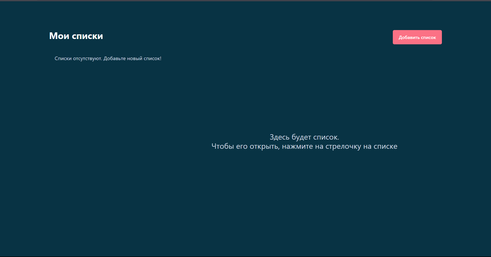
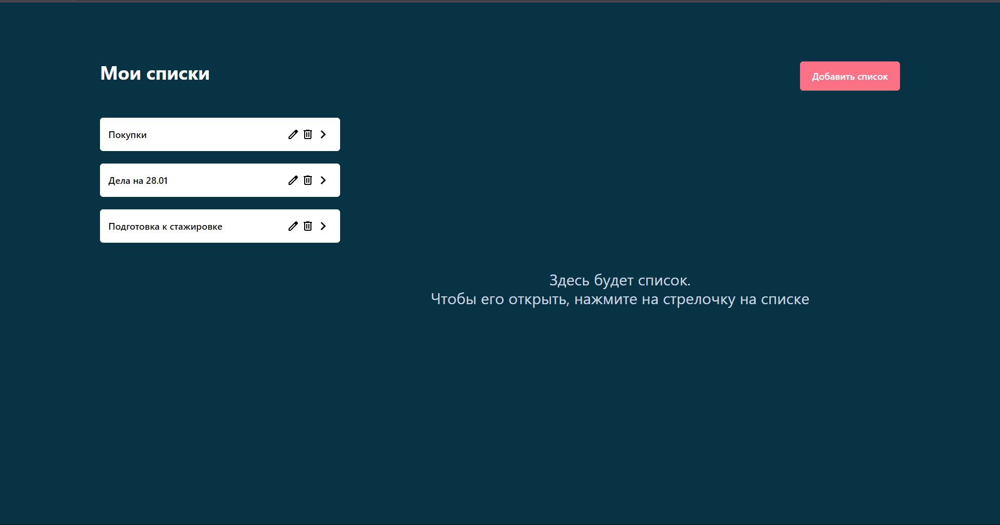
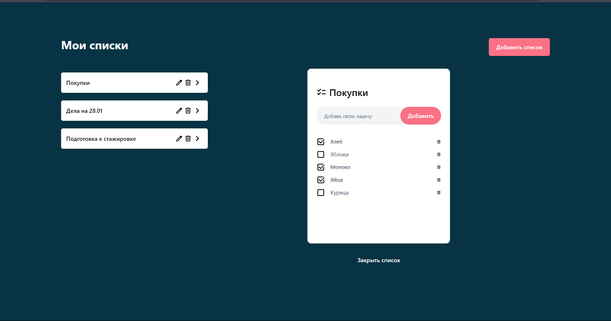

# Todo List Application

## Описание

Простое приложение для управления списками дел. Позволяет создавать списки, добавлять в них задачи, редактировать их названия, отмечать задачи как выполненные и удалять их. Все данные сохраняются в локальном хранилище браузера, чтобы не теряться между перезагрузками страницы.

### Скриншоты
#### Приложение без списков

#### Списки дел без выбранного списка

#### Открытый список дел



### Функционал

- **Списки**:
  - Создание нового списка.
  - Редактирование названия списка.
  - Удаление списка.
  - Просмотр содержимого списка.
  
- **Задачи**:
  - Добавление новой задачи.
  - Удаление задачи.
  - Отметка задачи как выполненной/невыполненной.

- **Сохранение данных**:
  - Все данные (списки и задачи) сохраняются в `localStorage` и автоматически восстанавливаются при повторном открытии приложения.

## Установка и запуск

1. **Склонируйте репозиторий:**

   ```bash
   git clone <URL_репозитория>
   ```
2. **Перейдите в директорию проекта:**

   ```bash
   cd <имя_папки_проекта>
   ```
3. **Установите зависимости:**

   ```bash
   npm install
   ```
4. **Запустите приложение:**

   ```bash
   npm run dev
   ```
5. **Откройте приложение в браузере:**
   Откройте http://localhost:5173, чтобы увидеть приложение.

## Структура проекта
* src/components — Компоненты React, включая:
  + Menu — Основной компонент для отображения списков.
  + List — Компонент для отдельного списка.
  + Todo — Компонент для задач внутри выбранного списка.
  + TodoItems — Компонент для отдельной задачи.
* src/assets — Иконки проекта.

## Использованные технологии
* React: Для создания интерфейса.
* Vite: Для быстрого сборщика приложений.
* Tailwind CSS: Для стилизации приложения.
   
